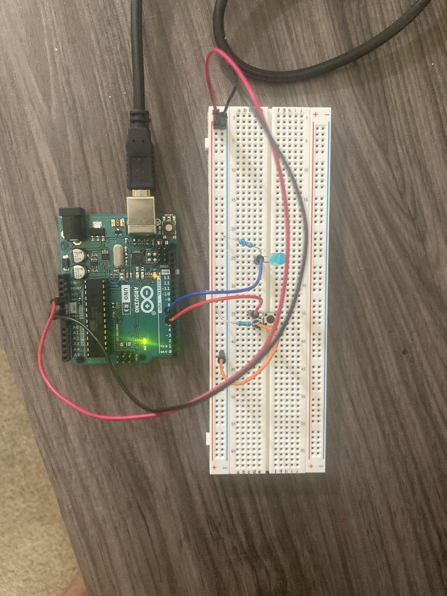

# LED Push Button

## Equipment
1. Breadboard
2. Arduino UNO R3 Micro-Controller
3. LED (Light Emitting Diode)
4. Five Jumper Wires
5. One 220 Ohm Resister
6. One 1k Ohm Resister
7. Switch Button
8. USB Cable
9. Arduino IDE

## Objective

The purpose of this project was to make an LED turn on or off depending on if the user presses/holds down on the button. 

## Demo

<a href="https://user-images.githubusercontent.com/63562144/120941995-d8b49d00-c6f3-11eb-86e6-97f3aa4c8128.MOV"> Demo Video </a>

